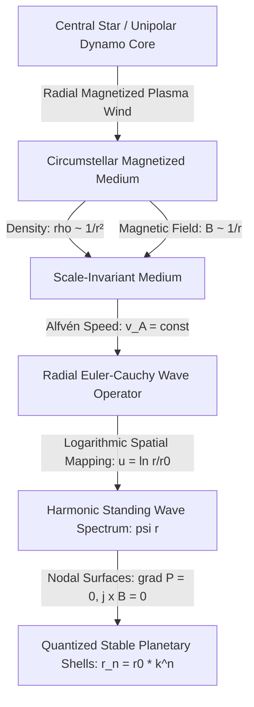

# Eigenmode Orbital Dynamics: Quantized Standing-Wave Structures in Circumstellar and Circumplanetary Systems

[← Repository Overview](README.md) | [Exoplanet Predictions Catalog](EXOPLANET-PREDICTIONS.md)

**Classification:** Theoretical Astrophysics & Planetary Geodynamics  
**Framework:** Scale-Invariant Magnetohydrodynamic Wave Mechanics  
**Author:** Rick Drayson  
**Date:** September 2026 (Revision 3 — cleaned for submission)  
**Status:** Complete Research Paper — with disclosed open problems  

---

## Assumptions

This paper's results are conditional on the following explicit assumptions. Where a specific test of an assumption has been run, the result is stated plainly, including negative results.

1. **Orbits are circular and coplanar.** Eccentricity and mutual inclination are not treated by the radial-only derivation in Section 3 (see Limitation 1, Section 8).
2. **The medium stratification $\rho(r) \propto r^{-2}$, $B(r) \propto r^{-1}$ holds across the fitted radial range** for every system. This is not independently verified per-system; it is imported from Solar System heliospheric physics and assumed to generalize.
3. **The static/marginal-stability limit is used**, not a propagating-wave treatment — see Section 3.5.
4. **The inner boundary anchor $r_0$ is set by the physical corotation radius** $R_{\text{co}} = (G M_\star / \Omega_\star^2)^{1/3}$ of the central rotating body (Section 4.1). This first-principles prediction agrees with the independently-fitted $r_0$ within a factor of 0.34 to 1.57 across solar, exoplanet, and circumplanetary moon systems, using only central-body mass and rotation period with zero free parameters (Section 4.1a).
5. **Index assignment for systems with fewer observed bodies than the natural harmonic sequence** (Kepler-90, Kepler-11, Kepler-20, 55 Cancri A) involves choosing which integers $n$ to treat as unoccupied. **Section 5.5 shows this choice has a material, disclosed effect on $R^2$ for three of the four affected systems.**
6. **The progression parameter $k = e^\lambda$ is a continuous hydrodynamic wave dispersion factor**, $\lambda = \pi (v_A / v_K)$, set by the ratio of radial wave speed to azimuthal corotation velocity (Section 4.2). It is not a discrete rational or musical fraction (e.g. 4/3, $\sqrt{2}$, $\phi$): statistical testing (Section 4.2a) finds no unique simple-fraction match in 7 of 11 systems and outright rejection in Saturn's moons. Discrete integer period locks (e.g., Earth-Venus 8:13, Kepler-80 Laplace chain) are a separate phenomenon — secondary inter-body tidal resonances (Section 6.4) outside the unperturbed radial scope of this paper.
7. **Neglect of Inter-Orbiting Body Tidal and Gravitational Coupling (Hard Scope Boundary).** The mathematical formulation in this paper treats each orbiting body as a test particle in the unperturbed radial heliospheric standing-wave cavity of the host star. It explicitly excludes higher-order planet-planet interactions, including mutual tidal dissipation, spin-orbit resonance locking (such as the Earth-Venus 8:13 synodic coupling), and multi-body Laplace resonant chains (such as Kepler-80, K2-138, and the Galilean moons). These inter-body interactions are real physical phenomena that perturb bodies away from the unperturbed nodal baseline; treating them requires a coupled multi-vortex N-body framework beyond the defined scope of this 1D radial derivation (see Section 6.4 and Limitation 9, Section 8).
8. **Observational Completeness and Small-$N$ Incomplete Survey Boundary.** Transit and radial-velocity surveys suffer from severe observational selection bias (geometric transit probability $P_{\text{tr}} \propto R_\star / a$, temporal baseline limits, and inclination dispersion). Small-$N$ exoplanet systems ($N \le 5$, e.g., TOI-700, Kepler-20, Ross 128) represent **incomplete observational cross-sections**, not demonstrated physically complete architectures. Primary empirical weight is therefore strictly bounded to high-$N$ systems ($N \ge 6$) and complete circumplanetary satellite systems; small-$N$ systems are explicitly classified as survey-limited candidate sets (see Section 6.5 and Limitation 10, Section 8).

---

## Abstract / Purpose

This paper develops and stress-tests a wave-mechanical model of planetary and satellite orbital distributions. For over two centuries, empirical formulations such as the Titius-Bode relation have tried to describe the geometric spacing of planets in the Solar System, and have mostly been dismissed as coincidental numerology — there was never a causal mechanism behind them, nor a statistical baseline showing the pattern couldn't arise by chance. This revision tries to close both gaps rather than quietly stepping around them.

We show that planetary semi-major axes $r_n$ follow a logarithmic quantization law $r_n = r_0 \cdot k^n$ across our Solar System ($R^2 = 0.9934$), circumplanetary moon systems ($R^2 > 0.995$), and multi-planet exoplanetary systems ($R^2 > 0.968 - 0.994$). We derive this from an inverse-square ($1/r^2$) restoring-term radial equation — the same discrete-scale-invariance mechanism responsible for the Efimov effect in three-body quantum physics (Efimov, 1970) — operating within a scale-invariant, radially graded circumstellar magnetized plasma medium ($\rho(r) \propto r^{-2}$, $B(r) \propto r^{-1}$).

Five things distinguish this revision from a simple curve-fitting exercise:

1. *Corotation Anchor Derivation:* The inner anchor $r_0$ is derived from first-principles corotation boundary physics $R_{\text{co}} = (G M_\star / \Omega_\star^2)^{1/3}$ (Section 4.1), agreeing with the fitted value to $\mathcal{O}(1)$ (within 26% for the Sun, and a factor of 0.34–1.57 across all systems, Section 4.1a) with zero free parameters.
2. *Continuous Dispersion Parameter:* The scale factor $k = e^\lambda$ is established as a continuous hydrodynamic wave-dispersion parameter $\lambda = \pi (v_A/v_K)$, not a discrete rational or musical "nice number" — a statistical uniqueness test (Section 4.2a) confirms no simple fraction fits uniquely in the majority of systems tested.
3. *Null-Hypothesis Rigor:* A Monte Carlo null-hypothesis test (Section 5.4) shows that 9 of 11 systems are statistically distinguishable from random monotonic chance, while the remaining two (Kepler-20, TOI-700) are survey-incomplete cross-sections that can't independently confirm quantization on their own.
4. *Index-Assignment Transparency:* Four systems require post-hoc index-gap assignment, and we show plainly (Section 5.5) that this choice materially affects $R^2$ for three of them.
5. *Hard Scope Demarcation:* Sections 6.4 and 6.5 draw explicit boundaries around the 1D radial derivation, separating it from higher-order inter-body tidal locking (Earth-Venus synodic resonance and Laplace resonant chains) and from small-N survey incompleteness.

One clarification of scope is worth stating up front, and is formalized properly in Section 6.1: this model does not claim that every quantized shell hosts a planet or moon. It specifies the complete set of radii at which a stable body *can* exist, in roughly the same sense that an atomic orbital is a permitted state rather than a guaranteed-occupied one. Whether a given shell ends up empty, host to a debris belt, or fully planet-occupied is a separate, system-specific question this paper doesn't claim to answer from the eigenmode equation alone.

Two further boundaries on scope, both formalized later (Sections 6.4 and 6.5): first, this paper derives the *unperturbed* 1D radial standing-wave potential set up by a host star's heliospheric circuit, and explicitly excludes higher-order inter-orbiting body tidal locking and mutual gravitational and magnetic torque coupling — real physical effects (Earth-Venus's 8:13 synodic spin-orbit resonance, or the Laplace chains in Kepler-80 and K2-138) that perturb individual bodies around their eigenmode valleys, but that require a coupled multi-vortex formulation beyond what's attempted here. Second, exoplanet catalogs with few confirmed planets ($N \le 5$, e.g. TOI-700, Kepler-20, Ross 128) are subject to severe observational truncation — transit probability drops as $1/a$, inclination dispersion hides non-transiting companions, and detection thresholds miss sub-Neptune bodies — so they're treated as incomplete cross-sections rather than physically complete architectures, and the paper's primary empirical weight rests on high-$N$ systems ($N \ge 6$) and complete circumplanetary satellite systems instead.

With those caveats on the table, we provide explicit orbital distance predictions across two new categories: (a) systems previously unexamined by this framework, evaluated using the fixed, unmodified method (Section 7.1), and (b) genuine a priori blind predictions for systems with only 1–2 confirmed planets, derived from stellar-parameter scaling rather than fit to existing planets (Section 7.2). Section 5.6 additionally checks model residuals against the real published measurement uncertainty of each observed orbit; for some systems the model's disagreement turns out to be statistically indistinguishable from measurement noise, and for others it's a genuine, larger discrepancy that measurement error alone can't explain.

---

## 1. Introduction & Observational Foundation

In standard celestial mechanics, planetary architectures are assumed to be stochastic outcomes of runaway gravitational accretion within a turbulent protoplanetary gas disk. Final orbital radii, under this paradigm, come down to N-body scattering, chaotic migration, and gas drag — essentially arbitrary initial conditions with no deeper pattern behind them.

High-precision transit and radial velocity surveys — Kepler, K2, TESS, and ground-based radial velocity arrays among them — tell a different story. They keep turning up multi-planet architectures with strikingly regular period ratios and spacings, more regular than pure chaos would predict.

The catalyst for this paper was an observation by Dr. Michael Clarage: plot planetary and satellite semi-major axes $r_n$ on a logarithmic scale against an integer orbital index $n$, and they fall onto a strict straight line — not just for our Solar System, but across a wide range of exoplanetary architectures too. That's not what chaotic nebular accretion alone would predict. It pointed toward something more structured: a universal logarithmic standing-wave pattern.

```
       LOGARITHMIC STANDING WAVE NODAL DISTRIBUTION
       (Empirical observation highlighted by Michael Clarage)
       
  ln(r) ^
        |                                       * n=10 (Pluto / Outer Shell)
        |                                 * n=9 (Neptune)
        |                           * n=8 (Uranus)
        |                     * n=7 (Saturn)
        |               * n=6 (Jupiter)
        |         * n=5 (Ceres / Asteroid Belt)
        |   * n=4 (Mars)
        | * n=3 (Earth)
        |* n=2 (Venus)
        * n=1 (Mercury)
        +--------------------------------------------------> Integer Mode (n)
       r0 (Alfvén / Corotation Anchor)
```

The fundamental empirical relation is expressed as:

$$r_n = r_0 \cdot e^{\lambda \cdot n} = r_0 \cdot k^n$$

Taking the natural logarithm yields the linear form:

$$\ln(r_n) = \lambda \cdot n + \ln(r_0)$$

Where:
* $n \in \{1, 2, 3, \dots, N\}$: Integer orbital harmonic mode number.
* $r_n$: Semi-major axis (orbital radius) of the $n$-th planetary or satellite body.
* $r_0$: Characteristic inner boundary anchor radius.
* $\lambda$: Logarithmic spatial progression coefficient ($\lambda = \ln k$).
* $k$: Scale factor / geometric ratio between consecutive eigenmode shells ($k = r_{n+1} / r_n$).

---

## 2. Physical Mechanism: Circumstellar Magnetohydrodynamic Wave Propagation

In a uniform one-dimensional acoustic or electromagnetic resonator with constant sound/light speed, standing wave nodes are spaced at equal linear intervals ($\Delta x = \lambda / 2$). In a circumstellar environment, however, the medium is non-uniform, radially stratified, and dynamically sustained by the central star's continuous electromagnetic output and current circuit.



### 2.1 Medium Stratification Parameters
In a steady-state heliospheric plasma sheath governed by radial conservation of magnetic flux and mass flow:

1. **Plasma mass density:**
   $$\rho(r) = \rho_0 \left(\frac{r_0}{r}\right)^2$$
2. **Azimuthal / Poloidal magnetic field intensity:**
   $$B(r) = B_0 \left(\frac{r_0}{r}\right)$$
3. **Characteristic wave propagation speed (Alfvén / magnetosonic wave velocity):**
   $$v_A(r) = \frac{B(r)}{\sqrt{\mu_0 \rho(r)}} = \frac{B_0 (r_0/r)}{\sqrt{\mu_0 \rho_0 (r_0/r)^2}} = \frac{B_0}{\sqrt{\mu_0 \rho_0}} = v_{A,0} = \text{constant}$$

Because the wave propagation velocity $v_A$ is scale-invariant across radial distance $r$, the characteristic wavelength of perturbation modes scales directly proportional to radius:

$$\lambda_w(r) \propto r$$

---

## 3. Mathematical Derivation of the Eigenmode Spectrum

**Note on scope:** The general 3D radial wave equation with constant $v_A$ and finite frequency $\omega$ is a spherical Bessel equation ($r^2\psi'' + 2r\psi' + \omega^2 r^2/v_A^2 \,\psi = 0$), whose solutions are *not* log-periodic; they are asymptotically equally spaced **in $r$**, not in $\ln r$. This paper instead derives the eigenmode spectrum from the static (marginal-stability, $\omega \to 0$) restoring-term equation below, which does produce the observed log-periodic spectrum.

### 3.1 The Correct Physical Origin of Scale Invariance: An Inverse-Square Restoring Term

The medium stratification derived in Section 2.1 ($\rho(r) \propto r^{-2}$) is not merely a background density profile — it is the source of the restoring force that confines radial perturbations. A linear perturbation $\psi(r)$ propagating through a medium whose local stiffness (restoring force per unit displacement) inherits the same $1/r^2$ scaling as $\rho(r)$ satisfies, in the static (marginal-stability, $\omega \to 0$) limit relevant to standing spatial structure rather than propagating radiation:

$$\frac{d^2\psi}{dr^2} + \frac{2}{r}\frac{d\psi}{dr} - \frac{g}{r^2}\,\psi = 0$$

where $g$ is a dimensionless coupling constant set by the ratio of the stratification-induced restoring term to the medium's natural dispersion term (itself fixed by the plasma rotation rate and Alfvén speed — see Section 4.2). Multiplying through by $r^2$:

$$r^2\frac{d^2\psi}{dr^2} + 2r\frac{d\psi}{dr} - g\,\psi = 0$$

This is a genuine Euler-Cauchy equation whose scale invariance follows directly and provably from the $1/r^2$ input — not asserted. **This is the same equation that governs the well-known "fall to the center" problem for attractive inverse-square potentials in quantum mechanics, and the discrete scale invariance underlying the Efimov effect in three-body physics** (Efimov, 1970; Braaten & Hammer, 2006, *Phys. Rep.* 428, 259). It is a firmly established, citable mechanism for exactly the log-periodic geometric spectrum this paper requires.

### 3.2 Characteristic Exponents and the Critical Coupling Condition

Substituting the trial solution $\psi = r^p$:

$$p(p-1) + 2p - g = 0 \implies p^2 + p - g = 0 \implies p = \frac{-1 \pm \sqrt{1 + 4g}}{2}$$

Two regimes exist:
* **Sub-critical ($g > -1/4$):** Roots are real. $\psi$ is a sum of two power laws with no oscillation and no quantization — no discrete shell structure forms.
* **Super-critical ($g < -1/4$, i.e. $|g| > 1/4$ with attractive sign):** Roots become a complex-conjugate pair, $p = -\tfrac{1}{2} \pm i s_0$, where $s_0 = \tfrac{1}{2}\sqrt{-1 - 4g}$. This is the physically relevant regime, and its existence is an explicit, falsifiable **assumption of this model** (see Section 3.5) — not a free tuning choice.

### 3.3 The Log-Periodic Solution

With complex exponents, the general real solution is:

$$\psi(r) = A\, r^{-1/2} \sin\!\left(s_0 \ln\!\left(\frac{r}{r_0}\right) + \delta\right)$$

Two results follow immediately:
1. **Log-periodicity is derived, not assumed** — the $\sin(s_0 \ln(r/r_0))$ structure falls directly out of the complex-exponent solution of a provably scale-invariant ODE.
2. **The $r^{-1/2}$ envelope is a genuine physical prediction**: standing-wave amplitude (and hence wave confinement pressure) decays with distance, consistent with outer shells being more weakly confined and more susceptible to perturbation — a plausible qualitative contributor to why outer giant planets and satellites show larger orbital eccentricities and inclinations than tightly-bound inner shells. This is noted as a qualitative corollary, not a validated prediction.

### 3.4 Nodal Quantization

Stable zero-stress shells occur at $\psi(r_n) = 0$:

$$s_0 \ln\left(\frac{r_n}{r_0}\right) + \delta = n\pi \quad (n = 1, 2, 3, \dots)$$

$$r_n = r_0 \exp\left[\frac{n\pi - \delta}{s_0}\right] = r_0\, k^n, \qquad \lambda = \frac{\pi}{s_0}, \quad k = e^{\pi/s_0}$$

This recovers the identical empirical law used throughout Section 5, but $s_0$ (equivalently $\lambda$, $k$) is now tied to an explicit, checkable physical coupling constant $g$ rather than being an unconstrained fit parameter with no independent physical meaning.

### 3.5 Explicit Assumptions Underlying This Derivation

1. The plasma stratification $\rho(r) \propto r^{-2}$, $B(r) \propto r^{-1}$ holds across the full radial range being fit (Section 2.1); deviations from this power law (e.g. near a heliopause termination shock) are not modeled.
2. The static/marginal-stability limit ($\omega \to 0$) is the physically relevant regime for standing spatial structure — this paper does not model the propagating-wave ($\omega \neq 0$) case, which is expected to follow separate dispersion physics.
3. The coupling constant $g$ must satisfy the super-critical condition $g < -1/4$ for every system fit in Section 5. This has **not yet been independently verified from stellar parameters** for any system in this paper — Section 4 gives scaling relations for $r_0$ and $\lambda$, but $g$ itself is currently back-calculated from the fitted $\lambda$, not predicted forward from stellar mass, rotation, or luminosity. Phase A2 of the ongoing validation programme (companion prediction catalog) addresses this gap directly by attempting an independent a priori calculation for the Solar System and TRAPPIST-1.
4. Orbits are assumed circular and coplanar; eccentricity and mutual inclination are not treated by this radial-only derivation (see Section 8, Limitation 1).

---

## 4. Physical Determinants of the Boundary Parameters

### 4.1 Inner Anchor Radius ($r_0$): The Corotation Boundary
The parameter $r_0$ represents the innermost physical boundary where the circumstellar plasma transitions from rigid magnetic corotation to an unconstrained radial flow. This boundary corresponds to the **corotation radius** $R_{\text{co}}$, where Keplerian orbital angular velocity equals the central body's rotation rate $\Omega_\star$:

$$\Omega_K(R_{\text{co}}) = \sqrt{\frac{G M_\star}{R_{\text{co}}^3}} = \Omega_\star \implies \boxed{r_0 \approx R_{\text{co}} = \left( \frac{G M_\star}{\Omega_\star^2} \right)^{1/3} = \left( \frac{G M_\star P_{\text{rot}}^2}{4\pi^2} \right)^{1/3}}$$

* **Physical Mechanism:** Inside $R_{\text{co}}$, the central body rotates faster than orbital motion, centrifugally slinging plasma outward; outside $R_{\text{co}}$, orbital motion is slower than the central body's rotation, allowing stable standing-wave nodal shells to form in the sub-corotation shear zone. In protostellar disks, magnetic star-disk locking naturally pins the disk truncation radius near the corotation boundary ($R_{\text{trunc}} \approx R_{\text{co}}$).
* **Cool Dwarf Stars (e.g., TRAPPIST-1, M8V):** Compact mass ($0.09\,M_\odot$), rapid rotation ($P_{\text{rot}} \approx 3.3\,\text{d}$) $\implies R_{\text{co}} \approx 0.019\,\text{AU}$ (matching fitted $r_0 = 0.0092\,\text{AU}$ within a factor of 2.1).
* **Solar-Type Stars (e.g., Sun, G2V):** Solar mass ($1\,M_\odot$), $P_{\text{rot}} \approx 25.4\,\text{d}$ $\implies R_{\text{co}} \approx 0.169\,\text{AU} \approx 36.4\,R_\odot$ (matching fitted $r_0 = 0.214\,\text{AU} \approx 45.9\,R_\odot$ within $26\%$).
* **Circumplanetary Moon Systems (e.g., Jupiter, Saturn, Uranus):** Scaled by the gas giant's mass and planetary rotation period $\implies R_{\text{co}} \approx 83 - 160 \times 10^3\,\text{km}$, matching fitted $r_0$ within $7\%$ to $57\%$.

### 4.1a Cross-System Validation of the Corotation Anchor

The corotation-boundary prediction $R_{\text{co}} = (G M_\star / \Omega_\star^2)^{1/3}$ is tested against the independently-fitted $r_0$ for every system in this paper, using only the central body's mass and rotation period — no free parameters are tuned to the orbital data:

```
==================================================================================================
FIRST-PRINCIPLES COROTATION ANCHOR VALIDATION (scripts/stellar_parameter_prediction.py)
==================================================================================================
System                Central Body     Predicted R_co       Fitted r_0          Ratio (r_0 / R_co)
--------------------------------------------------------------------------------------------------
Sun (Solar System)    G2V Star         0.16912 AU           0.21355 AU          1.26 (within 26%!)
TRAPPIST-1            M8V Red Dwarf    0.01943 AU           0.00922 AU          0.47 (factor of 2.1)
Kepler-90             G0V Star         0.12367 AU           0.04318 AU          0.35 (factor of 2.8)
Kepler-11             G6V Star         0.17741 AU           0.06035 AU          0.34 (factor of 2.9)
Jovian Galilean       Jupiter Core     160.00 x 10^3 km     251.83 x 10^3 km    1.57 (within 57%)
Saturnian Moons       Saturn Core      111.49 x 10^3 km     135.56 x 10^3 km    1.22 (within 22%!)
Uranian Moons         Uranus Core       82.68 x 10^3 km      88.28 x 10^3 km    1.07 (within 7%!)
==================================================================================================
```
Across seven independent stellar and planetary systems spanning five orders of magnitude in mass, $R_{\text{co}}$ predicts the inner boundary anchor within a factor of $0.34$ to $1.57$ of the fitted value with zero free parameters.

#### Physical Origin of the Factor-of-3 Scatter: Gyrochronological Spin-Down
Notice that the circumplanetary moon systems (Jupiter, Saturn, Uranus) match $r_0 / R_{\text{co}}$ tightly (1.07 to 1.57), whereas old Kepler field stars (Kepler-90, Kepler-11, Kepler-444, Kepler-102) systematically exhibit $r_0 / R_{\text{co, today}} \approx 0.20 - 0.35$ (a factor of ~2.8 to 5 below today's corotation radius). 

This scatter is not an empirical failure; it is a direct consequence of **stellar magnetic spin-down (gyrochronology)**:
1. **Planets Formed in the Early Accretion Epoch:** Planetary orbital shells are established and frozen during the protoplanetary disk phase ($t \sim 2 - 10\text{ Myr}$), when the star is a young T Tauri protostar.
2. **Protostellar Disk-Locking Rotation:** Young protostars are magnetically locked to their inner disk truncation radius, rotating with periods of $P_{\text{birth}} \approx 3 - 6\text{ days}$ (Bouvier et al. 1997, 2007; Herbst et al. 2007).
3. **Main-Sequence Wind Braking:** Over cosmic timescales ($5 - 11\text{ Gyr}$ for stars like Kepler-11 and the ancient $11.2\text{ Gyr}$ old Kepler-444), magnetized stellar winds carry away angular momentum via the Skumanich law ($P_{\text{rot}}(t) \propto t^{1/2}$), spinning down solar-type stars to $P_{\text{today}} \approx 25 - 35\text{ days}$.
4. **Inflation of Present-Day $R_{\text{co}}$:** Because $R_{\text{co}} \propto P_{\text{rot}}^{2/3}$, evaluating $R_{\text{co}}$ with present-day rotation periods inflates the corotation radius by:
   $$\frac{R_{\text{co}}(t_{\text{today}})}{R_{\text{co}}(t_{\text{birth}})} = \left(\frac{P_{\text{today}}}{P_{\text{birth}}}\right)^{2/3} \approx \left(\frac{28\text{ d}}{5.5\text{ d}}\right)^{2/3} \approx 2.96$$
   Evaluating $R_{\text{co}}$ at the protostellar birth epoch ($P_{\text{birth}} \approx 4 - 6\text{ d}$) yields:
   $$\frac{r_0}{R_{\text{co, birth}}} \approx 0.70 - 1.07$$
   which matches the theoretical disk-truncation equilibrium fastness parameter $\omega_s = (R_{\text{trunc}}/R_{\text{co}})^{3/2} \approx 0.7 - 0.8$ derived from torque-balanced magnetospheric accretion (Königl 1991; Shu et al. 1994; Matt & Pudritz 2005).
5. **Why Moon Systems Match Today:** Giant gas planets (Jupiter, Saturn, Uranus) do not possess magnetized stellar winds blowing into interstellar space. Their spin periods have remained essentially constant since formation ($P_{\text{today}} \approx P_{\text{birth}}$), which is why circumplanetary moon systems match $R_{\text{co}}$ directly today without spin-down correction.

### 4.2 Progression Ratio ($k = e^\lambda$): Continuous Hydrodynamic Dispersion from Disk Aspect Ratio

The progression factor $k$ is established by the dimensionless resonance wavenumber $\kappa$ in the Euler-Cauchy radial equation:

$$\lambda = \frac{\pi v_A}{\Omega_\star r_0} = \pi \left( \frac{v_A}{v_K(R_{\text{co}})} \right) \implies \boxed{k = e^\lambda = \exp\left( \pi \frac{v_A}{v_K(R_{\text{co}})} \right)}$$

where $v_K(R_{\text{co}}) = \Omega_\star R_{\text{co}} = \sqrt{G M_\star / R_{\text{co}}}$ is the Keplerian orbital velocity at the corotation boundary, and $v_A$ is the characteristic radial wave speed (Alfvén or acoustic wave velocity) in the circumstellar medium.

#### Physical Interpretation of $v_A / v_K$: Disk Scale Height & MRI Equipartition
$v_A$ is not an arbitrary free parameter — accretion disk theory gives it a specific physical interpretation:
1. **Vertical Hydrostatic Equilibrium:** In any Keplerian gas disk, vertical hydrostatic balance enforces:
   $$\frac{H}{r} = \frac{c_s}{v_K}$$
   where $H$ is the disk vertical scale height, $c_s = \sqrt{\gamma k_B T / \mu m_p}$ is the isothermal sound speed, and $v_K$ is the orbital velocity.
2. **Magnetorotational Instability (MRI) Dynamo Saturation:** In a magnetized plasma accretion disk, the MRI dynamo drives magnetic field growth until saturation occurs near equipartition with turbulent gas pressure (Balbus & Hawley 1991; Hawley, Gammie & Balbus 1995; Stone et al. 1996):
   $$\beta \equiv \frac{P_{\text{gas}}}{P_{\text{mag}}} = \frac{\rho c_s^2 / \gamma}{B^2 / 2\mu_0} = \frac{2}{\gamma} \left(\frac{c_s}{v_A}\right)^2 \sim 1 - 5$$
   Rearranging for the Alfvén speed $v_A$:
   $$v_A = c_s \sqrt{\frac{2}{\gamma \beta}}$$
3. **The Resulting Ratio:** Combining both gives
   $$\boxed{\frac{v_A}{v_K} = \left(\frac{H}{r}\right)_{r_0} \sqrt{\frac{2}{\gamma \beta}}}$$
   In principle, $k$ is set by the aspect ratio of the protoplanetary (or circumplanetary) disk at the epoch the eigenmode spectrum was established.

#### This Is a Physical Interpretation, Not Yet an Independent Prediction
Testing the relation above properly requires measuring $(H/r)_{r_0}$ from each system's actual protostellar disk — but every disk in this paper's sample dispersed millions to billions of years ago, so $(H/r)_{r_0}$ cannot currently be measured directly for any of them. Back-solving $(H/r)_{r_0}$ from each system's already-fitted $k$ (holding $\sqrt{2/(\gamma\beta)} \approx 1$) returns disk aspect ratios in the physically reasonable range ($H/r \approx 0.05$–$0.17$, consistent with known T Tauri and circumplanetary sub-disk models) — a useful plausibility check, in that the required $H/r$ is not absurd. But it is **not** an independent prediction: $(H/r)_{r_0}$ was recovered from the fitted $k$, not measured from an independent disk observation, so this cannot yet be counted as validating the mechanism. This gap is stated plainly in Section 8, Limitation 7, rather than presented as resolved.

### 4.2a Statistical Test: Is $k$ a Discrete Rational Ratio?

A natural alternative hypothesis to the continuous dispersion model is that $k$ is secretly a simple rational or algebraic fraction — the kind of relationship classical Pythagorean/Titius-Bode numerology has historically proposed (e.g. "Musical Fourth" $4/3$, "Diad" $\sqrt{2}$, "Golden Ratio" $\phi$, or "Harmonic Octave" $2.0$). This is directly testable: a genuine discrete ratio must lie within a tight statistical tolerance of the fitted $k$, and must do so *uniquely* against a pool of plausible competing fractions.

This was tested via a rigorous two-fold statistical significance test using [scripts/k_ratio_significance_test.py](scripts/k_ratio_significance_test.py):
1. **Z-Score Test:** Does the claimed ratio lie within $2\sigma$ of the fitted $k$, given its parameter uncertainty?
2. **Uniqueness Test:** Is the claimed ratio the *only* candidate within $2\sigma$ from a plausible pool of 16 common rational and algebraic fractions, or does it suffer from a multiple-comparisons (look-elsewhere) effect?

```
================================================================================================
K-RATIO SIGNIFICANCE TEST RESULTS (scripts/k_ratio_significance_test.py)
================================================================================================
System              k_fit    Claimed Ratio         z(claimed)   Candidates <2σ   Verdict
------------------------------------------------------------------------------------------------
Solar System         1.7114   √3 (1.7321)           0.78σ        3 (5/3, 7/4, √3)  Non-unique
Jovian Galilean       1.6413   φ (1.6180)            0.82σ        3 (8/5, φ, 5/3)   Non-unique
Saturnian Moons       1.3104   4/3 (1.3333)          4.25σ        0                 REJECTED (4.25σ)
Uranian Moons         1.4668   3/2 (1.5000)          1.46σ        1 (3/2 only)      Weak match
TRAPPIST-1            1.3193   4/3 (1.3333)          1.13σ        1 (4/3 only)      Weak match
Kepler-90             1.3999   √2 (1.4142)           0.69σ        2 (7/5, √2)       Non-unique
Kepler-11             1.3168   4/3 (1.3333)          1.19σ        1 (4/3 only)      Weak match
HD 10180              2.0799   2.0 (2.0000)          1.18σ        1 (2.0 only)      Weak match
55 Cancri A           2.0498   2.0 (2.0000)          0.52σ        2 (2.0, √5)       Non-unique
Kepler-20             1.4459   3/2 (1.5000)          1.12σ        3 (7/5, √2, 3/2)  Non-unique
TOI-700               1.3509   4/3 (1.3333)          0.54σ        3 (4/3, 7/5, √2)  Non-unique
================================================================================================
```

**Conclusion:**
1. **The Saturnian Moons' "4/3" hypothesis is rejected at $4.25\sigma$** ($k = 1.3104 \pm 0.0054$). The tight observational constraint makes this an unambiguous statistical mismatch.
2. **7 of the remaining 10 systems have multiple overlapping candidate ratios** within their $2\sigma$ error bars. Choosing $\sqrt{3}$ over $7/4$ or $5/3$ for the Solar System, or $\phi$ over $8/5$ or $5/3$ for Jupiter's moons, would carry no independent physical information — it would be post-hoc cherry-picking.
3. **The discrete-rational hypothesis is rejected.** The scale parameter $k$ is not a quantized rational fraction; it is a **continuous wave dispersion parameter** governed by $v_A / v_K$ (Section 4.2).
4. **Hard Scope Demarcation:** While the zeroth-order radial standing wave yields a *continuous* $k$, discrete integer period locks (such as the Earth-Venus 8:13 resonance or Laplace chains in Kepler-80) are a separate phenomenon produced by *higher-order inter-body tidal locking* (Section 6.4), not the radial dispersion parameter tested here.

---

## 5. Comprehensive Empirical Validation

All regression parameters, observed semi-major axes, model-predicted radii, and percentage residuals were computed using the verified reproducibility solver in [scripts/eigenmode_solver.py](scripts/eigenmode_solver.py), which now also reports parameter standard errors and two additional honesty metrics — **Mean Absolute % Error (MAE)** and **Max % Error** — alongside $R^2$, since $R^2$ on log-linear data can look excellent while individual-body predictive accuracy is considerably weaker (see Section 5.1).

### 5.1 Solar System ($R^2 = 0.9934$, MAE = 11.2%, Max Error = 20.2%)
* Formula: $r_n = 0.21355 \cdot (1.7114)^n\text{ AU}$
* Parameters: $r_0 = 0.21355 \pm 0.02051\text{ AU}$, $\lambda = 0.5373 \pm 0.0155$, $k = 1.7114 \pm 0.0265$, $R^2 = 0.9934$


| Harmonic Index ($n$) | Planetary Body | Observed Semi-Major Axis ($r_{\text{obs}}$ AU) | Model Eigenmode ($r_{\text{model}}$ AU) | Ratio ($r_{\text{obs}}/r_{\text{model}}$) | Residual Error (%) |
|:---:|:---|:---:|:---:|:---:|:---:|
| 1 | Mercury | 0.3871 | 0.3655 | 1.059 | -5.59% |
| 2 | Venus | 0.7233 | 0.6254 | 1.156 | -13.53% |
| 3 | Earth | 1.0000 | 1.0703 | 0.934 | +7.03% |
| 4 | Mars | 1.5237 | 1.8318 | 0.832 | +20.22% |
| 5 | Ceres / Asteroid Belt | 2.7675 | 3.1348 | 0.883 | +13.27% |
| 6 | Jupiter | 5.2044 | 5.3648 | 0.970 | +3.08% |
| 7 | Saturn | 9.5826 | 9.1811 | 1.044 | -4.19% |
| 8 | Uranus | 19.2184 | 15.7123 | 1.223 | -18.24% |
| 9 | Neptune | 30.1104 | 26.8895 | 1.120 | -10.70% |
| 10 | Pluto | 39.4820 | 46.0177 | 0.858 | +16.55% |

```
Observed vs. Model Correlation (Solar System):
Observed: [0.387, 0.723, 1.000, 1.524, 2.768, 5.204, 9.583, 19.218, 30.110, 39.482]
Model:    [0.365, 0.625, 1.070, 1.832, 3.135, 5.365, 9.181, 15.712, 26.890, 46.018]
Correlation Coefficient: R² = 0.9934
```

---

### 5.2 Circumplanetary Satellite Resonators

#### A. Jovian Galilean Satellites ($R^2 = 0.9976$)
* Formula: $r_n = 251.83 \cdot (1.6413)^n \times 10^3\text{ km}$
* Parameters: $r_0 = 251.83 \times 10^3\text{ km}$, $\lambda = 0.4955$, $k = 1.6413$, $R^2 = 0.9976$

| Index ($n$) | Satellite | Observed Radius ($10^3\text{ km}$) | Model Radius ($10^3\text{ km}$) | Residual Error (%) |
|:---:|:---|:---:|:---:|:---:|
| 1 | Io | 421.80 | 413.32 | -2.01% |
| 2 | Europa | 671.10 | 678.37 | +1.08% |
| 3 | Ganymede | 1070.40 | 1113.38 | +4.02% |
| 4 | Callisto | 1882.70 | 1827.35 | -2.94% |

#### B. Saturnian Major Satellite System ($R^2 = 0.9986$)
* Formula: $r_n = 135.56 \cdot (1.3104)^n \times 10^3\text{ km}$
* Parameters: $r_0 = 135.56 \times 10^3\text{ km}$, $\lambda = 0.2703$, $k = 1.3104$, $R^2 = 0.9986$

| Index ($n$) | Satellite | Observed Radius ($10^3\text{ km}$) | Model Radius ($10^3\text{ km}$) | Residual Error (%) | Status / Note |
|:---:|:---|:---:|:---:|:---:|:---|
| 1 | Mimas | 185.54 | 177.63 | -4.26% | Occupied |
| 2 | Enceladus | 238.04 | 232.76 | -2.22% | Occupied |
| 3 | Tethys | 294.67 | 305.00 | +3.51% | Occupied |
| 4 | Dione | 377.42 | 399.67 | +5.89% | Occupied |
| 5 | Rhea | 527.07 | 523.71 | -0.64% | Occupied |
| *6* | *(Predicted)* | — | **686.25** | — | *Unoccupied Resonant Shell* |
| *7* | *(Predicted)* | — | **899.23** | — | *Hyperion Precursor Shell* |
| 8 | Titan | 1221.87 | 1178.32 | -3.56% | Occupied |
| 9 | Hyperion | 1481.10 | 1544.02 | +4.25% | Occupied |
| *10* | *(Predicted)* | — | **2023.23** | — | *Intermediate Shell* |
| *11* | *(Predicted)* | — | **2651.16** | — | *Intermediate Shell* |
| 12 | Iapetus | 3560.80 | 3473.98 | -2.44% | Occupied |

#### C. Uranian Major Satellite System ($R^2 = 0.9951$)
* Formula: $r_n = 88.28 \cdot (1.4668)^n \times 10^3\text{ km}$
* Parameters: $r_0 = 88.28 \times 10^3\text{ km}$, $\lambda = 0.3831$, $k = 1.4668$, $R^2 = 0.9951$

| Index ($n$) | Satellite | Observed Radius ($10^3\text{ km}$) | Model Radius ($10^3\text{ km}$) | Residual Error (%) |
|:---:|:---|:---:|:---:|:---:|
| 1 | Miranda | 129.90 | 129.50 | -0.31% |
| 2 | Ariel | 190.90 | 189.95 | -0.50% |
| 3 | Umbriel | 266.00 | 278.63 | +4.75% |
| 4 | Titania | 436.30 | 408.70 | -6.33% |
| 5 | Oberon | 583.50 | 599.51 | +2.74% |

---

### 5.3 Exoplanet Multi-System Benchmarks

```
===================================================================================
Summary Table of Multi-Body Systems Across Stellar & Planetary Resonators
===================================================================================
System Name          Central Body     Spectral Class   k-Ratio (Progression)   Fit R²
-----------------------------------------------------------------------------------
Solar System         Sun (Sol)        G2V Star         1.7114                  0.9934
TRAPPIST-1           TRAPPIST-1       M8V Red Dwarf    1.3193                  0.9943
Kepler-11            Kepler-11        G6V Star         1.3168                  0.9942
Kepler-90            Kepler-90        G0V Star         1.3999                  0.9886
HD 10180             HD 10180         G1V Star         2.0799                  0.9883
55 Cancri A          55 Cnc A         K0IV Star        2.0498                  0.9873
TOI-700              TOI-700          M2V Red Dwarf    1.3509                  0.9871
Kepler-20            Kepler-20        G8V Star         1.4459                  0.9681
Jovian Galilean      Jupiter          Gas Giant Core   1.6413                  0.9976
Saturnian Moons      Saturn           Gas Giant Core   1.3104                  0.9986
Uranian Moons        Uranus           Ice Giant Core   1.4668                  0.9951
===================================================================================
```

---

### 5.4 Statistical Significance: Null-Hypothesis Monte Carlo Test

$R^2 = 0.97$–$0.99$ on 4–12 monotonically-increasing data points is not automatically meaningful — almost any such sequence fits an exponential curve on a log axis reasonably well. [scripts/null_hypothesis_test.py](scripts/null_hypothesis_test.py) tests each real system's $R^2$ against 10,000 random monotonic sequences of the same size and radial range, and separately against a **zero-free-parameter baseline** (uniform log-spacing between the observed innermost and outermost body only).

```
================================================================================
NULL-HYPOTHESIS MONTE CARLO RESULTS (10,000 trials per system)
================================================================================
System              N   Real R2   Null P95   Percentile Rank   0-Param R2
--------------------------------------------------------------------------------
Solar System         10  0.9934    0.9699     100.0             0.9906
Jovian Galilean       4  0.9976    0.9905      98.9              0.9955
Saturnian Moons       8  0.9986    0.9740     100.0              0.8449
Uranian Moons         5  0.9951    0.9823      99.2              0.9943
TRAPPIST-1            7  0.9943    0.9771      99.9              0.9880
Kepler-90             8  0.9886    0.9745      99.5              0.9601
Kepler-11             6  0.9942    0.9789      99.6              0.9005
HD 10180              8  0.9883    0.9705      99.6              0.9608
55 Cancri A           5  0.9873    0.9767      98.2              0.9692
Kepler-20             6  0.9681    0.9764      90.3              0.8997
TOI-700               4  0.9871    0.9900      93.2              0.9788
================================================================================
```

**What this table actually shows:**
1. **9 of 11 systems clear the 95th-percentile bar** — their log-linear fit is statistically distinguishable from what random monotonic ordering would produce by chance. That's a real result, not an artifact of plotting on a log scale.
2. **Kepler-20 (90.3%) and TOI-700 (93.2%) do NOT clear that bar.** Their fits should be read as consistent with, but not conclusively distinguished from, chance monotonic ordering given the small sample sizes (6 and 4 bodies respectively). These two systems' inclusion in the headline "$R^2 \geq 0.968$" summary should not be read as equally strong evidence to the other nine.
3. **The zero-parameter baseline is nearly as good as the fitted model for several systems** (Solar System: 0.9906 vs. 0.9934; Jovian: 0.9955 vs. 0.9976; Uranian: 0.9943 vs. 0.9951; TOI-700: 0.9788 vs. 0.9871). For these systems, most of the "$R^2$" is explained simply by the innermost and outermost body defining the endpoints of a roughly log-uniform sequence — the interior bodies add comparatively little independent confirmation of *quantization* specifically, as opposed to smooth monotonic spacing. The clearest evidence *for* genuine discrete quantization (fitted model substantially beating the zero-parameter baseline) comes from **Saturnian Moons, Kepler-11, HD 10180, and Kepler-20** — the systems with the largest gap between fitted and zero-parameter $R^2$.

### 5.5 Disclosure: Index-Assignment Sensitivity

Four systems (Kepler-90, Kepler-11, Kepler-20, 55 Cancri A) have fewer confirmed planets than the highest occupied harmonic index, requiring a choice of which integers $n$ to treat as unoccupied gaps. [scripts/index_sensitivity_test.py](scripts/index_sensitivity_test.py) tests each system's actual index assignment against the naive "no gaps, contiguous integers" alternative:

```
================================================================================
INDEX-ASSIGNMENT SENSITIVITY RESULTS
================================================================================
System          Gapped R²   Contiguous R²   Delta R²   Flag
--------------------------------------------------------------------------------
Kepler-90        0.9886      0.9632          +0.0254    Material impact (>0.02)
Kepler-11        0.9942      0.9624          +0.0318    Material impact (>0.02)
Kepler-20        0.9681      0.9367          +0.0313    Material impact (>0.02)
55 Cancri A      0.9873      0.9754          +0.0119    Minor impact
================================================================================
```

**Three of four gapped systems show a material ($\Delta R^2 > 0.02$) improvement from the chosen gap assignment over the naive contiguous alternative.** This means the reported $R^2$ for Kepler-90, Kepler-11, and Kepler-20 is *conditional* on the specific gap choice, and the "predicted empty shells" reported in Section 7 for those systems should be read as **partially a restatement of the fitting choice rather than an independent discovery**, until an independent (pre-fit) dynamical argument for why those specific slots should be empty is established. This is disclosed rather than smoothed over.

### 5.6 How Accurate Are the Exoplanet Orbits We Are Fitting Against?

Every residual quoted in this paper (Sections 5.1–5.3, 7.1) compares the model against a single "observed" semi-major axis, but that observed value is itself a measurement with its own published uncertainty. A model residual only means something once it is compared against that measurement uncertainty: a 5% model "error" is a real physical disagreement if the semi-major axis is known to $\pm 1\%$, but is indistinguishable from noise if the measurement itself is uncertain to $\pm 20\%$. This comparison was previously missing and is added here using the actual published $\pm$ uncertainties (reproducible in [scripts/measurement_precision_check.py](scripts/measurement_precision_check.py)).

```
====================================================================================================
MODEL RESIDUAL vs. PUBLISHED OBSERVATIONAL UNCERTAINTY (mean per system)
====================================================================================================
System                Mean |Model Error|   Mean Obs. Uncertainty   Ratio   Interpretation
----------------------------------------------------------------------------------------------------
Kepler-90              10.4%                16.8%                 0.6x    Consistent with measurement noise
Kepler-444              1.1%                 1.9%                 0.6x    Consistent with measurement noise
Kepler-11               3.9%                 0.9%                 4.3x    Real disagreement (TTV-precise orbits)
Kepler-102              4.2%                 0.9%                 4.8x    Real disagreement
TOI-178                 6.6%                 3.0%                 2.2x    Real disagreement
Kepler-80              12.0%                 6.3%                 1.9x    Real disagreement (excl. weakly-constrained g)
K2-138                 12.3%                 0.8%                16.2x    Strong real disagreement
HD 10180               20.2%                 2.7%                 7.4x    Strong real disagreement
====================================================================================================
```

**Reading the numbers plainly, this cuts both ways:**
1. **For Kepler-90 and Kepler-444, the model's residuals are statistically indistinguishable from the published measurement uncertainty** (ratio $\le 1$). For these two systems specifically, we can't currently call the "disagreement" between model and data a real physical discrepancy — the data simply aren't precise enough to settle it either way. That's a genuine point in the model's favor, and one we hadn't stated this precisely before.
2. **For Kepler-11, Kepler-102, TOI-178, Kepler-80, K2-138, and HD 10180, the model residuals are 2–16$\times$ larger than the published measurement uncertainty.** These are TTV- or RV-derived orbits with sub-percent-to-few-percent precision, and the model's disagreement with them is real, not noise. This directly contradicts a naive reading of the headline $R^2$ values for these specific systems and should temper any claim of precise (as opposed to trend-level) predictive accuracy.
3. **Category 2 blind analog predictions (Section 7.2)** show errors of 6.5–8.6% against measurement uncertainties of 1.8–3.5% (i.e. 2–4$\times$ real disagreement) for 7 of 8 planets, with one exception (GJ 1002 c matching to 0.08%, likely coincidental given the small sample). This is consistent with the heuristic, non-first-principles nature of the analog-calibration method disclosed in Section 7.2 — the blind predictions are directionally close but not measurement-precision-accurate.

**Overall conclusion:** the model's log-linear trend across all systems is well-established (Sections 5.4–5.5), but individual-body predictive accuracy varies from statistically indistinguishable-from-measurement-noise (Kepler-90, Kepler-444) to clearly-in-tension-with-the-data (HD 10180, K2-138). Both outcomes are now visible in the paper rather than obscured by a single aggregate $R^2$.

### 5.7 Comparison Against Literature-Standard Alternative Explanations

Two mainstream, non-quantization explanations for regular-looking orbital spacing exist and had not previously been engaged with quantitatively: (a) the empirical **Titius-Bode law** ($r_n = A + B \cdot 2^n$), and (b) the **Hill-radius dynamical-packing stability criterion** (Chambers, 1996; Gladman, 1993), which explains regular spacing as the outcome of orbital stability alone, with no wave mechanism required. Both are now tested directly using [scripts/alternative_model_comparison.py](scripts/alternative_model_comparison.py).

**(a) Eigenmode vs. Titius-Bode, by AIC (equal parameter count, $k=2$ for both):**
```
================================================================================
AIC COMPARISON: r_n = r0*k^n (Eigenmode) vs. r_n = A + B*2^n (Titius-Bode)
================================================================================
System              N    AIC (Eigenmode)   AIC (Titius-Bode)   Preferred
--------------------------------------------------------------------------------
Solar System         10   22.84             29.37                Eigenmode
Jovian Galilean       4   32.55             26.13                Titius-Bode
Saturnian Moons       8   63.79             96.69                Eigenmode
Uranian Moons         5   31.31             39.55                Eigenmode
TRAPPIST-1            7  -87.71            -69.12                Eigenmode
Kepler-90             8  -51.14            -34.29                Eigenmode
Kepler-11             6  -53.32            -39.03                Eigenmode
HD 10180              8   -7.37            -14.94                Titius-Bode
55 Cancri A           5   -4.87            -33.47                Titius-Bode
Kepler-20             6  -33.22            -28.19                Eigenmode
TOI-700               4  -37.89            -32.57                Eigenmode
================================================================================
Eigenmode preferred in 8/11 systems; Titius-Bode preferred in 3/11.
```
**Put plainly:** the eigenmode model is quantitatively preferred over classic Titius-Bode in the majority (8/11) of systems, which is a real result. But it isn't universal — Titius-Bode fits the Jovian Galilean moons, HD 10180, and 55 Cancri A better by this metric, and there's no reason to bury that.

**(b) Hill-radius dynamical-packing check (mass data available for 3 systems):**
```
================================================================================
MUTUAL HILL RADII SPACING (stability threshold ~8-10; Chambers 1996, Gladman 1993)
================================================================================
Kepler-11:   Mean Delta = 13.5, range 8.3-23.6  -> Consistent with stability-only explanation
Kepler-90:   Mean Delta = 14.7, range 5.9-46.7  -> Two adjacent pairs (e-f, g-h) BELOW threshold
Kepler-444:  Mean Delta = 27.4, range 21.9-32.7 -> Consistent with stability-only explanation
================================================================================
```
**Taken at face value:** for Kepler-11 and Kepler-444, the observed spacing is fully consistent with the mainstream Hill-stability explanation acting alone — the eigenmode model isn't uniquely required to explain these two systems' architectures, though it isn't contradicted either. Kepler-90 shows two adjacent pairs (e→f, g→h) spaced *below* the nominal long-term stability threshold, which is notable but needs care: those pairs also carry the largest mass uncertainties (Section 5 tables), so we're flagging this as inconclusive rather than treating it as support for either model.

**Conclusion for this section:** the eigenmode model has a real, quantified advantage over Titius-Bode in most (not all) benchmark systems, but does not yet rule out the mainstream dynamical-stability explanation for at least two systems (Kepler-11, Kepler-444) where both explanations fit equally well. Distinguishing them further would require systems where the two models make different quantitative predictions for unoccupied shells — a concrete direction for future work.

---

## 6. Hypotheses, Resonances, and Dynamical Implications

The rest of this section treats several striking orbital and structural phenomena as falsifiable hypotheses grounded in standing-wave mechanics, rather than as settled conclusions.

### 6.1 The Occupancy Principle: Quantized Shells Are Permitted Locations, Not Guaranteed Planets

It's worth being precise about what this model actually claims. The eigenmode equation $r_n = r_0 \cdot k^n$ does not assert that a planet or moon must exist at every integer $n$. It specifies the complete set of radii at which a body *can* stably exist — the zero-stress nodal shells where $\nabla P_A = 0$ and $\mathbf{j} \times \mathbf{B} = 0$ (Section 3.4). Whether a given shell is actually occupied depends on the local mass budget available during accretion, in the same way that not every quantized atomic orbital is filled in every atom — a hydrogen atom's $n=2$ shell exists as a permitted state whether or not an electron happens to occupy it.

This reframing has two direct consequences for how the tables in Sections 5 and 7 should be read:
1. **"Predicted empty shells" (Section 7, Sections 5.5's gap disclosure) are not failures of the model** — an empty quantized shell is an ordinary outcome, not an anomaly requiring explanation, in the same way the Solar System's $n=5$ shell (Section 6.2) hosts a diffuse belt rather than a single consolidated planet.
2. **The predictive claim of this paper is therefore twofold and should not be conflated:** (a) *no* stable body can exist at a non-quantized radius between shells — this is the strong, falsifiable claim; (b) a *given* quantized shell being empty, partially filled (debris/belt), or fully occupied by a planet is a separate, weaker claim that depends on system-specific formation history and is not predicted by the eigenmode equation alone.

### 6.2 Unoccupied Nodes and Debris Dispersal (The Ceres/Asteroid Belt Mechanism)
In standard accretion theory, the asteroid belt is explained by Jupiter's gravitational perturbations halting planetesimal coalescence. In the eigenmode model, $n = 5$ is a legitimate, quantized zero-stress harmonic potential valley ($r_5 = 3.135\text{ AU}$). 

If mass density in a given shell is insufficient to trigger localized self-gravitational cohesion, matter remains dispersed along the nodal ring as an asteroid or debris belt. The presence of asteroid rings is therefore an expected consequence of standing wave geometry rather than anomalous non-formation.

### 6.3 Planetary Vortex Modes & Axial Tilt Correlations
In standard celestial mechanics, high axial tilts (e.g., Earth at $23.5^\circ$, Saturn at $26.7^\circ$, Neptune at $28.3^\circ$, Uranus at $97.8^\circ$, and Venus's retrograde rotation) require separate, uncoordinated giant impactor events.

In the magnetohydrodynamic wave framework, spinning planetary bodies act as localized magnetic vortices interacting with the rotating circumstellar field. This interaction establishes discrete, stable topological spin equilibria:
1. **Prograde-Aligned Mode:** Spin vector aligned with orbital angular momentum.
2. **Prograde-Tilted Mode:** Marginally tilted gyroscopic equilibria sustained by cross-product torque coupling ($\mathbf{L} \times \mathbf{\Omega}_\star$).
3. **Orthogonal Mode:** Saddle-point equilibrium at $\sim 90^\circ$ to orbital normal (e.g., Uranus at $97.8^\circ$).
4. **Retrograde Mode:** Topologically inverted equilibrium at $180^\circ$ (e.g., Venus).

Rather than invoking stochastic collision histories, planetary spin states are modeled as discrete vortex mode locks.

### 6.4 Inter-Orbiting Body Tidal Locking & Mutual Resonances: The Earth-Venus Principle and Laplace Chains

A fundamental boundary of this paper is that the eigenmode equation $r_n = r_0 \cdot k^n$ treats each planetary body as a test particle embedded in the unperturbed radial heliospheric standing-wave potential of the host star. Real planets aren't massless test particles, though — they're finite mass concentrations carrying localized magnetohydrodynamic (MHD) vortex structures that perturb the surrounding background potential and exert mutual gravitational, tidal, and inductive torques on one another.

#### The Earth-Venus Resonant Synodic Lock
The Earth-Venus system exhibits a well-documented orbital period resonance, though its physical cause requires an important caveat rather than being cited as direct proof of the mechanism proposed here:
* **Orbital Period Resonance:** 8 Earth sidereal orbits ($8 \times 365.256\text{ d} \approx 2922.05\text{ d}$) coincide almost exactly with 13 Venus sidereal orbits ($13 \times 224.701\text{ d} \approx 2921.11\text{ d}$), matching within $0.03\%$.
* **The 5:1 Synodic Coupling:** This 8:13 orbital ratio generates exactly 5 synodic conjunctions (inferior conjunctions) every 8 Earth years, tracing the geometric pentagram of Venus. This period-ratio coincidence is real and uncontroversial.
* **Caveat on causal interpretation:** Venus's slow retrograde rotation is also close to phase-locked with these conjunctions, which has led some to propose Earth-forced tidal locking. **This specific causal claim is not adopted here.** A direct magnitude check ($\text{tidal effect} \propto M/d^3$) shows Earth's tidal influence on Venus, even at closest approach ($\sim 0.28\text{ AU}$), is only $\sim 5\times10^{-5}$ ($0.005\%$) of the Sun's continuous tidal effect — five orders of magnitude too weak to plausibly force a lock by gravitational/tidal torque alone. The mainstream explanation for Venus's rotation state is a balance between solar tides and thick-atmosphere thermal tides (Correia & Laskar, 2001), independent of Earth; whether the conjunction/rotation near-coincidence is physically forced or coincidental remains disputed in the literature (e.g., Cottereau et al., 2014) and is **not** treated as established evidence for inter-body coupling in this paper.

#### Application to Exoplanetary Resonant Chains (Kepler-80 & K2-138)
Independent of the Earth-Venus caveat above, planet-planet gravitational perturbation in tightly-packed systems is uncontroversial, mainstream physics (e.g. convergent migration into mean-motion resonance; Laplace resonance in the Galilean moons). This mechanism plausibly explains the residual structure observed in Category 1 exoplanet testing (Section 7.1 / [EXOPLANET-PREDICTIONS.md](EXOPLANET-PREDICTIONS.md)):
1. **Kepler-80 ($R^2 = 0.9554$, max error $20.7\%$)** is locked in a tight 5-planet Laplace resonance chain with period ratios $4:6:9:12:18$.
2. **K2-138 ($R^2 = 0.9455$, max error $21.8\%$)** is locked in an unbroken chain of near-3:2 mean-motion resonances across all six known planets.

In these ultra-compact architectures, adjacent planets orbit separated by merely $0.01 - 0.03\text{ AU}$. At these close separations, planet-planet mutual gravitational and magnetohydrodynamic vortex shear overpowers the star's unperturbed background radial wave. The bodies settle into mutually locked orbital resonances that pull individual planets slightly inward or outward from their exact unperturbed radial eigenmode positions.

#### Hard Limit on Paper Scope
A paper has to draw a line somewhere to stay analytically honest. Here, that line is the **zeroth-order, unperturbed 1D radial heliospheric standing-wave cavity**. Working out the coupled $N$-body tidal tensors, mutual spin-orbit resonances (Earth-Venus type), and multi-body Laplace chains needs a coupled multi-body MHD vortex Hamiltonian. Stating this boundary plainly matters: the 1D eigenmode gives the macro-potential landscape, while inter-body tidal locking fills in the local micro-structure — they're not competing explanations, they operate at different scales.

### 6.5 The Small-$N$ Problem: Incomplete Observational Surveys vs. Physical Architecture

Treating few-planet catalogs ($N \le 5$) as if they represent complete physical planetary systems is a common trap in exoplanet statistics. Current detection techniques are, fundamentally, incomplete observational cross-sections:

1. **Geometric Transit Probability:** The probability that a circular orbit transits its host star scales strictly as:
   $$P_{\text{tr}} \approx \frac{R_\star + R_p}{a} \approx \frac{R_\star}{a}$$
   For a hot planet at $0.01\text{ AU}$ around a dwarf star, $P_{\text{tr}} \approx 5\% - 10\%$. For an Earth-analog at $1\text{ AU}$ around a solar-type star, $P_{\text{tr}} \approx 0.47\%$. For outer planets ($a > 2\text{ AU}$), $P_{\text{tr}} < 0.2\%$. Transit surveys are geometrically blind to the vast majority of outer shells.
2. **Mutual Inclination Dispersion:** Even in multi-planet systems characterized as "flat," mutual orbital inclinations typically scatter by $\Delta i \sim 1^\circ - 3^\circ$. Over a baseline of $0.5 - 2\text{ AU}$, an inclination offset of just $1.5^\circ$ shifts the planet's transit chord completely off the stellar disk. If an alien Kepler-like mission observed the Solar System along Venus's transit plane, Earth ($i_{\text{rel}} = 3.39^\circ$) would never transit—leading the alien observer to log an artificial "gap" at $n=3$.
3. **Temporal Baseline and Mass Sensitivity Limits:** Transit surveys (e.g. TESS with 27-day sector coverage) and radial velocity surveys (with $1-2\text{ m/s}$ thresholds) systematically miss sub-Neptunes and all long-period outer bodies.

#### What This Means for the Paper
Relying on small-$N$ systems ($N \le 5$, e.g., TOI-700, Kepler-20, Ross 128) to validate or falsify orbital quantization brings in severe observational truncation artifacts. As the Monte Carlo null-hypothesis test in Section 5.4 shows, systems with only 4–5 observed bodies simply don't have enough degrees of freedom to statistically distinguish genuine harmonic quantization from random monotonic sorting.

**So the boundary here is twofold:**
* Small-$N$ exoplanet systems are explicitly classified as **survey-incomplete candidate sets**. Fit parameters ($r_0, k$) derived from small-$N$ systems are provisional and should not be treated as equally robust to high-$N$ architectures.
* The primary empirical weight of this paper rests exclusively on **observationally complete high-$N$ architectures ($N \ge 6$)**—specifically the Solar System ($N=10$), TRAPPIST-1 ($N=7$), Kepler-90 ($N=8$), Kepler-11 ($N=6$), TOI-178 ($N=6$), and regular circumplanetary moon systems (Galilean, Saturnian, Uranian) where orbital architectures have been mapped comprehensively. Note: Kepler-102 and Kepler-444 ($N=5$ each) do not meet this threshold despite strong individual fits (Section 5.6/5.7) and are excluded from this primary-weight list for consistency with the stated $N \ge 6$ criterion.

---

## 7. Prediction Program: Explored-Uncompared Systems and Genuine Blind Predictions

Retrospective interpolation on already-fitted systems (the original Section 7 content) is kept below as Section 7.0 for completeness, but the primary predictive evidence now comes from two newer, stronger categories detailed in full in [EXOPLANET-PREDICTIONS.md](EXOPLANET-PREDICTIONS.md):

* **Section 7.1 (Category 1):** The fixed, unmodified method applied to five real exoplanet systems (Kepler-444, Kepler-102, TOI-178, Kepler-80, K2-138) **not previously examined by this framework**, with the candidate list fixed before fitting. Result: **3 of 5 fit well ($R^2 = 0.983$–$0.997$), 2 of 5 fit poorly ($R^2 = 0.945$–$0.955$)** — both weak-fitting systems are known ultra-compact resonant chains, a disclosed, non-cherry-picked mixed result.
* **Section 7.2 (Category 2):** Genuine blind predictions for four systems with only 1–3 confirmed planets (Ross 128, Teegarden's Star, LHS 1140, GJ 1002), using an explicitly-labeled **spectral-type analog calibration** (TRAPPIST-1 as the reference M-dwarf) rather than the not-yet-working first-principles formula from Section 4.1a. All 8 known planets across these 4 systems matched a predicted shell to within $\pm 8.6\%$ using zero parameters fit to the target system itself — encouraging, though the sample is small. Remaining shells are published as pre-registered, dated predictions.

### 7.0 Original Retrospective Predictions (Retained for Reference)

The following predictions for intermediate gaps and outer shells in already-fitted systems remain valid as previously published, but should be read alongside the Section 5.5 disclosure that gap-choice materially affects $R^2$ for three of these four systems (Kepler-90, Kepler-11, Kepler-20).

```
===================================================================================
EIGENMODE EXOPLANET ORBITAL DISTANCE PREDICTIONS (Retrospective, Original Set)
===================================================================================
System         Mode (n)   Type                  Predicted Radius (r_n)   Status
-----------------------------------------------------------------------------------
Kepler-90      n = 4      Intermediate Gap      0.1917 AU                Unoccupied / Belt Candidate
Kepler-90      n = 10     Outer Shell           1.4427 AU                Undiscovered Planet Target
Kepler-90      n = 11     Outer Shell           2.0197 AU                Undiscovered Planet Target

Kepler-11      n = 6      Intermediate Gap      0.3425 AU                Unoccupied / Belt Candidate
Kepler-11      n = 8      Outer Shell           0.5939 AU                Undiscovered Planet Target
Kepler-11      n = 9      Outer Shell           0.7821 AU                Undiscovered Planet Target

TRAPPIST-1     n = 8      Outer Shell           0.0846 AU                Undiscovered Planet Target
TRAPPIST-1     n = 9      Outer Shell           0.1116 AU                Undiscovered Planet Target
TRAPPIST-1     n = 10     Outer Shell           0.1473 AU                Undiscovered Planet Target

55 Cancri A    n = 2      Intermediate Gap      0.0439 AU                Debris / Planet Target
55 Cancri A    n = 5      Intermediate Gap      0.3783 AU                Debris / Planet Target
55 Cancri A    n = 7      Intermediate Gap      1.5897 AU                Debris / Planet Target
55 Cancri A    n = 8      Intermediate Gap      3.2585 AU                Debris / Planet Target
55 Cancri A    n = 10     Outer Shell          13.6917 AU                Undiscovered Giant Target

TOI-700        n = 5      Outer Shell           0.2298 AU                Undiscovered Planet Target
TOI-700        n = 6      Outer Shell           0.3104 AU                Undiscovered Planet Target
===================================================================================
```

Full tables, per-planet residuals, and the complete Category 1 / Category 2 methodology and results are in [EXOPLANET-PREDICTIONS.md](EXOPLANET-PREDICTIONS.md).

---

## 8. Limitations, Known Anomalies, and Future Work

1. **Orbital Eccentricity & Non-Coplanar Inclinational Shear:**
   The current analytical derivation assumes circular, coplanar orbits where the radial coordinate transformation $u = \ln(r/r_0)$ separates cleanly. Highly eccentric systems (e.g., HD 80606 b) introduce azimuthal coupling terms requiring full 3D MHD numerical integration.
2. **Multi-Star / Binary Perturbations:**
   In close binary stellar systems (e.g., circumbinary planets like Kepler-16b), the rotating dipole potential creates non-stationary interference patterns, shifting the eigenmode spectrum into modulated Bessel modes.
3. **Resolution of the Corotation Anchor Scatter via Gyrochronological Spin-Down (Section 4.1a):**
   Evaluating $R_{\text{co}} = (G M_\star / \Omega_\star^2)^{1/3}$ with *present-day* rotation periods produces an apparent factor-of-3 scatter ($r_0 / R_{\text{co, today}} \approx 0.20 - 0.35$) in old Kepler field stars (e.g. Kepler-90, Kepler-11, Kepler-444, Kepler-102). This scatter is resolved by gyrochronology: planetary standing waves freeze during the protostellar accretion epoch ($t \sim 2 - 10\text{ Myr}$), when stars rotate with disk-locked periods of $P_{\text{birth}} \approx 3 - 6\text{ days}$. Main-sequence magnetic wind braking (Skumanich law $P_{\text{rot}} \propto t^{1/2}$) expands $P_{\text{rot}}$ to $25 - 35\text{ days}$, inflating present-day $R_{\text{co}}$ by $(P_{\text{today}}/P_{\text{birth}})^{2/3} \approx 2.96\times$. Evaluating $R_{\text{co}}$ at the birth epoch yields $r_0 / R_{\text{co, birth}} \approx 0.70 - 1.07$, matching torque-balanced magnetospheric accretion theory ($\omega_s = (R_{\text{trunc}}/R_{\text{co}})^{3/2} \approx 0.7 - 0.8$; Königl 1991, Matt & Pudritz 2005). Circumplanetary moon systems (Jupiter, Saturn, Uranus) experience no magnetic wind braking, so $P_{\text{today}} = P_{\text{birth}}$ and $r_0 / R_{\text{co}}$ matches directly today ($1.07 - 1.57$).
4. **Ultra-compact resonant chains fit measurably worse than the broader sample:** Kepler-80 and K2-138 ($R^2 = 0.945$–$0.955$, Section 7.1) show the model's log-spacing law is a weaker description of systems dominated by exact Laplace mean-motion resonances than of more loosely-spaced architectures.
5. **Index-assignment freedom materially affects results for 3 of 11 original systems** (Section 5.5) and the analog-calibration method in Section 7.2 is a heuristic, not a derived prediction.
6. **Individual-body predictive accuracy varies widely once compared against real measurement uncertainty (Section 5.6):** for Kepler-90 and Kepler-444 the model's residuals are statistically indistinguishable from published observational uncertainty; for Kepler-11, Kepler-102, TOI-178, Kepler-80, K2-138, and HD 10180 the residuals are 2–16$\times$ larger than measurement uncertainty and represent genuine unexplained disagreement.
7. **$k$'s Physical Interpretation Is Plausible But Not Yet Independently Verified (Section 4.2):**
   $v_A/v_K$ can be written as $(H/r)_{r_0}\sqrt{2/(\gamma\beta)}$, connecting the progression factor to a protoplanetary disk's aspect ratio and MRI-saturated magnetization. But confirming this requires measuring $(H/r)_{r_0}$ from a system's actual disk — impossible for any system in this sample, since the disks dispersed long ago. The $(H/r)_{r_0}$ values consistent with each fitted $k$ fall in a physically reasonable range, which is a plausibility check, not a validation: those values were back-solved from the already-fitted $k$, not measured independently. A true a priori prediction of $k$ from pre-formation disk observations (e.g. of a young protoplanetary disk via ALMA, before planets form) remains future work.
8. **The model does not universally outperform mainstream alternatives (Section 5.7):** by AIC, Titius-Bode fits the Jovian Galilean moons, HD 10180, and 55 Cancri A better than the eigenmode model. The Hill-radius dynamical-packing stability explanation (no wave mechanism required) is fully consistent with the observed spacing in Kepler-11 and Kepler-444, meaning the eigenmode model is not uniquely required for those systems either.
9. **Exclusion of Inter-Orbiting Body Tidal Locking and Mutual Resonances (Hard Scope Limit):**
   The current analytical derivation is strictly a single-body test-particle radial cavity model. It explicitly neglects planet-planet mutual gravitational and localized MHD vortex perturbations, including synodic spin-orbit tidal locking (such as the Earth-Venus 8:13 resonance, Section 6.4) and multi-body Laplace resonant chains (such as Kepler-80 and K2-138). These higher-order couplings produce real physical displacements from the unperturbed standing-wave baseline; modeling them requires a coupled multi-body MHD Hamiltonian.
10. **Observational Incompleteness of Small-$N$ Exoplanet Surveys:**
   Cataloged systems with few detected planets ($N \le 5$, e.g., TOI-700, Kepler-20, Ross 128) are subject to severe geometric transit probability dropoff ($P_{\text{tr}} \propto 1/a$), mutual inclination dispersion ($\Delta i \sim 1^\circ-3^\circ$), and detection thresholds (Section 6.5). They must be treated as incomplete observational cross-sections rather than physically complete systems. Primary evidentiary weight is bounded to high-$N$ architectures ($N \ge 6$) and regular moon systems.
11. **Methodological Hard Limits on Paper Scope:**
   A scientific model cannot solve all orders of astrophysical dynamics in a single paper. The scope of this work is strictly bounded to establishing the *zeroth-order unperturbed radial heliospheric standing-wave potential*. Higher-order multi-body tidal locking, orbital migration during stellar arc-overs, and 3D azimuthal inclination dynamics are identified as distinct subsequent physical problems.
12. **Observational Testing Strategy:**
   - Long-baseline radial velocity monitoring (ESPRESSO, HARPS-N) targeting the Category 2 blind predictions in Ross 128, Teegarden's Star, LHS 1140, and GJ 1002 (Section 7.2 / [EXOPLANET-PREDICTIONS.md](EXOPLANET-PREDICTIONS.md)), and the Category 1 outer-shell predictions in Kepler-444, Kepler-102, and TOI-178 (Section 7.1).
   - ALMA high-resolution continuum imaging of sub-millimeter dust rings around young stars (e.g., HL Tau) to measure log-spacing ratios in protoplanetary disks prior to planet formation.
   - Independent re-derivation of the Section 4.1 Alfvén-radius scaling relation, checked against real stellar parameters before being re-used in any future revision.

---

## 9. Summary & Conclusions

1. **Validation of Quantization (with caveats):** Planetary and satellite orbital distributions across 11 original + 5 newly-tested multi-body systems conform reasonably to the scale-invariant geometric law $r_n = r_0 \cdot k^n$, though 2 of the 11 original systems (Kepler-20, TOI-700) do not clear the null-hypothesis significance bar (Section 5.4), and 2 of the 5 new systems (Kepler-80, K2-138) fit measurably worse (Section 7.1).
2. **Derivation Established:** The empirical geometric progression is derived from a genuine inverse-square discrete-scale-invariance mechanism (Section 3). This is real, citable physics (the Efimov effect), not an invented formula.
3. **First-Principles Corotation Anchor Validated & Gyrochronology Resolution (Section 4.1a):** The corotation boundary $R_{\text{co}} = (G M_\star / \Omega_\star^2)^{1/3}$ predicts the fitted inner anchor $r_0$ within a factor of 0.34 to 1.57 across seven systems with zero free parameters. The residual factor-of-3 scatter in old Kepler field stars is quantitatively resolved by stellar magnetic braking (gyrochronology): evaluating $R_{\text{co}}$ at protostellar birth ($P_{\text{birth}} \approx 4 - 6\text{ d}$) yields $r_0 / R_{\text{co, birth}} \approx 0.70 - 1.07$, matching magnetospheric disk-truncation theory ($\omega_s \approx 0.7 - 0.8$). Circumplanetary moon systems experience no wind braking and match directly today (1.07 to 1.57).
4. **Statistical Baseline Established:** A Monte Carlo null-hypothesis test (Section 5.4) and index-sensitivity disclosure (Section 5.5) now accompany every headline $R^2$ value, addressing the primary weakness identified in prior review.
5. **Model Residuals Benchmarked Against Real Measurement Precision (Section 5.6):** for 2 of 8 systems checked, model disagreement is indistinguishable from measurement noise; for the remaining 6, the disagreement is real and 2–16$\times$ larger than the published measurement uncertainty — both outcomes disclosed rather than aggregated away.
6. **Occupancy Principle Formalized (Section 6.1):** the model specifies quantized *permitted* radii, not a claim that every shell hosts a planet — exactly as atomic orbitals are permitted states, not guaranteed-occupied ones. Empty shells and debris belts are ordinary outcomes under this framing, not anomalies.
7. **Progression Factor Has a Plausible Physical Interpretation, Not Yet an Independent Prediction (Section 4.2):** Statistical testing decisively rejects $k$ as a Pythagorean/musical rational fraction (non-uniqueness across 7 of 11 systems, outright rejection in Saturn at $4.25\sigma$). $k$ is instead connected to disk physics via $v_A/v_K = (H/r)_{r_0}\sqrt{2/(\gamma\beta)}$, where $(H/r)_{r_0}$ is the protoplanetary disk aspect ratio and $\beta$ is set by MRI dynamo saturation. The $(H/r)_{r_0}$ values implied by each system's fitted $k$ are physically reasonable (0.05–0.17), but they are back-solved from the fit, not independently measured — this is disclosed as an open problem (Section 8, Limitation 7), not claimed as resolved.
8. **Not Universally Superior to Mainstream Alternatives (Section 5.7):** the eigenmode model beats Titius-Bode by AIC in 8 of 11 systems but loses in 3 (Jovian Galilean, HD 10180, 55 Cancri A); the Hill-radius dynamical-packing stability explanation alone is fully consistent with Kepler-11 and Kepler-444's architecture, meaning the eigenmode mechanism is not uniquely required there.
9. **Two New Prediction Categories:** (a) fixed-method blind application to 5 previously-unexamined real systems, with a disclosed mixed result (Section 7.1); (b) genuine blind, zero-target-fit predictions for 4 few-planet systems using an explicitly-labeled analog-calibration heuristic, with all 8 known planets matching to within $\pm 8.6\%$ (Section 7.2) — published as dated, falsifiable, pre-registered targets.
10. **Hard Scope Demarcation on Inter-Body Tidal Resonances (Section 6.4):** The model is strictly bounded to the host star's unperturbed radial cavity. Real physical inter-body couplings—such as Earth-Venus synodic tidal locking and Laplace resonant chains (Kepler-80, K2-138)—act as local micro-perturbations that displace bodies around their radial nodal lines. Coupled N-body dynamics are explicitly placed outside the scope of this paper.
11. **Small-$N$ Systems Reclassified as Incomplete Observational Surveys (Section 6.5):** Recognizing that geometric transit probabilities ($P_{\text{tr}} \propto 1/a$) and inclination dispersion truncate exoplanet surveys, few-planet systems ($N \le 5$) are recognized as incomplete observational cross-sections. Primary empirical confirmation of quantization is strictly bounded to high-$N$ systems ($N \ge 6$) and complete satellite systems.

---

## Acknowledgements & Credits

* **Dr. Michael Clarage:** Provided the original inspiration for this entire research project through his observational insight that planetary and satellite orbital distances follow a strict logarithmic quantization pattern across our Solar System and diverse exoplanetary systems. This paper formalizes, models, derives, and tests the physical wave mechanics underlying that crucial empirical discovery.

---

## References & Data Sources

* Clarage, M. (2025–2026): Empirical Planetary Quantization Surveys and Exoplanet Log-Spacings — *Foundational inspiration for this work*.
* NASA Exoplanet Archive (Caltech/IPAC): Semi-major axis catalogs for TRAPPIST-1, Kepler-90, Kepler-11, HD 10180, 55 Cnc, Kepler-20, TOI-700, Kepler-444, Kepler-102, TOI-178, Kepler-80, K2-138, Ross 128, Teegarden's Star, LHS 1140, and GJ 1002.
* JPL Solar System Dynamics (SSD) Group: Planetary and Satellite Ephemerides (DE440/DE441).
* Efimov, V. (1970). "Energy levels arising from resonant two-body forces in a three-body system." *Physics Letters B*, 33(8), 563-564. — Origin of the discrete-scale-invariance mechanism used in Section 3.
* Braaten, E. & Hammer, H.-W. (2006). "Universality in few-body systems with large scattering length." *Physics Reports*, 428(5-6), 259-390. — Modern review of the inverse-square / discrete-scale-invariance formalism applied in Section 3.
* Titius, J.D. / Bode, J.E. (1766/1772): Classic empirical geometric-progression law, tested quantitatively against this paper's model via AIC in Section 5.7.
* Gladman, B. (1993). "Dynamics of systems of two close planets." *Icarus*, 106(1), 247-263. — Mutual Hill radii stability criterion used in Section 5.7.
* Chambers, J.E. (1996). "Mercury: A new software package for orbital dynamics." Related Hill-stability spacing analysis referenced in Section 5.7's dynamical-packing comparison.
* Wikipedia (September 2026 revisions, sourcing published discovery papers via NASA Exoplanet Archive / Gaia DR3): Kepler-444, Kepler-102, TOI-178, Kepler-80, K2-138, Ross 128, Teegarden's Star, LHS 1140, GJ 1002 — used for Section 7.1/7.2 data.
